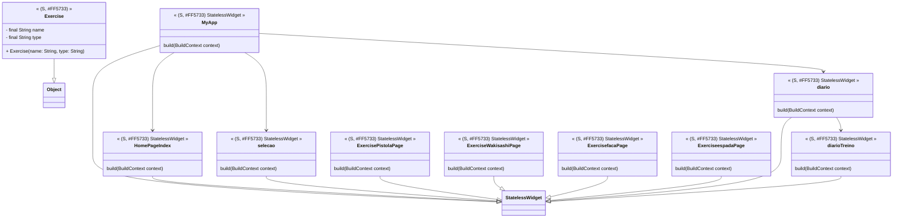

# treino_lucas_upado

App desenvolvido para regrar o treino do Lucas com seus equipamentos, para fins marciais e esportivos.

## Diagrama de classes

```mermaid
classDiagram
    class MyApp {
        << (S, #FF5733) StatelessWidget >>
        build(BuildContext context)
    }

    class HomePageIndex {
        << (S, #FF5733) StatelessWidget >>
        build(BuildContext context)
    }

    class diario {
        << (S, #FF5733) StatelessWidget >>
        build(BuildContext context)
    }

    class diarioTreino {
        << (S, #FF5733) StatelessWidget >>
        build(BuildContext context)
    }

    class selecao {
        << (S, #FF5733) StatelessWidget >>
        build(BuildContext context)
    }

    class Exercise {
        << (S, #FF5733) >>
        - final String name
        - final String type
        + Exercise(name: String, type: String)
    }

    class ExercisePistolaPage {
        << (S, #FF5733) StatelessWidget >>
        build(BuildContext context)
    }

    class ExerciseWakisashiPage {
        << (S, #FF5733) StatelessWidget >>
        build(BuildContext context)
    }

    class ExercisefacaPage {
        << (S, #FF5733) StatelessWidget >>
        build(BuildContext context)
    }

    class ExerciseespadaPage {
        << (S, #FF5733) StatelessWidget >>
        build(BuildContext context)
    }

    MyApp --|> StatelessWidget
    MyApp --> HomePageIndex
    MyApp --> selecao
    MyApp --> diario

    HomePageIndex --|> StatelessWidget

    diario --|> StatelessWidget
    diario --> diarioTreino

    diarioTreino --|> StatelessWidget

    selecao --|> StatelessWidget

    Exercise --|> Object

    ExercisePistolaPage --|> StatelessWidget
    ExerciseWakisashiPage --|> StatelessWidget
    ExercisefacaPage --|> StatelessWidget
    ExerciseespadaPage --|> StatelessWidget
```
